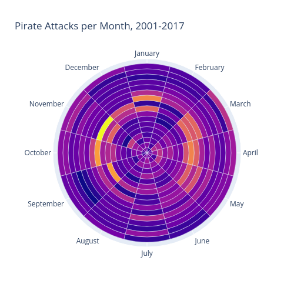

# QGIS Plugin Data Clock

Data Clock chart for QGIS: plot seasonal time series data as a polar heat map. Inspired by the [data clock chart of ArcGIS Pro](https://pro.arcgis.com/en/pro-app/latest/help/analysis/geoprocessing/charts/data-clock.htm).

For visualisation of seasonal/cyclic time series data. The rings of the chart show the larger, cyclic time unit 
(e.g. year), while each ring is divided into smaller units shown as wedges.

The data is binned into these wedges and the color is determined by the count of data rows or by an aggregation function 
(e.g. 'sum', 'mean', 'median') on a specified numerical column.

The following combinations of rings and wedges are implemented:
Year-Month, Year-Week, Year-Day, Week-Day, Day-Hour.

The result is a HTML file with an interactive Plotly chart (including a tooltip on hover).

> Requires [Pandas](https://pandas.pydata.org/) and [Plotly](https://plotly.com/python/)




## Resources 
- QGIS Plugins Repository: [https://plugins.qgis.org/plugins/qgis_data_clock/](https://plugins.qgis.org/plugins/qgis_data_clock/)
- Source Code: [https://github.com/florianneukirchen/qgis_data_clock](https://github.com/florianneukirchen/qgis_data_clock)
- Bug Tracker: [https://github.com/florianneukirchen/qgis_data_clock/issues](https://github.com/florianneukirchen/qgis_data_clock/issues)

## Installation
Requirements: [Pandas](https://pandas.pydata.org/) and [Plotly](https://plotly.com/python/) can be installed with pip or conda. They are also included in some Linux Distributions.

The plugin is in the QGIS plugin registry and can be installed in QGIS with `Plugins` - `Manage and Install Plugins`.  "Show also Experimental Plugins" must be checked.

Source Code: Copy or git clone the plugin folder into your QGIS plugins folder (on Linux: `~/.local/share/QGIS/QGIS3/profiles/default/python/plugins/`) and enable the plugin in QGIS (Plugins - Manage and Install Plugins). Eventually, "Show also Experimental Plugins" must be checked.

## Usage

The tool can be found in the processing toolbox.

Parameters:
- Input Layer: Vector Layer, should have at least one Date or DateTime field. You can use a QGIS expression to filter the data, e.g.: `"mydatefield" >= '2020-01-01' AND "mydatefield" < '2024-01-01'`
- Mode: combinations of rings and wedges: Year-Month, Year-Week, Year-Day, Week-Day, Day-Hour.
- Date field: field in the attribute table of the input layer, type must be Date or DateTime 
- Aggregation function: Binning with an aggregate function over the field of parameter "Aggregation field". Default is count of features
- Aggregation field: Numerical field to be aggregated
- Color scale: Use one of Plotly's [Build-in Sequential Colorscales](https://plotly.com/python/builtin-colorscales/#builtin-sequential-color-scales)
- Invert Colorscale
- Show a colorbar
- Title

Advanced Parameters
- Locale: Overwrite locale to change the language of month / weekday names. Use a string such as "de_DE" or "en_US". However, the locale names depend on your operating system, and it only works with installed locales. (Only tested on Linux)

The output is a HTML with an interactive Plotly chart. It can be opened from the QGIS Results Viewer.

## Usage from the Python Console

It is possible to call the figure factory functions from the QGIS python console. This allows to change the plot with Plotly methods such as `fig.update_layout()` and `fig.update_traces()`.

API documentation:
- [factory.layer_to_df()](doc/factory/todataframe.md) 
- [factory.dataclock()](doc/factory/dataclockfactory.md) 

The following example gives a data clock chart in dark mode, with title centered an in larger font size:

```python
import qgis_data_clock.factory as dcf
import pandas as pd
import plotly.graph_objects as go

layer = iface.activeLayer()
df = dcf.layer_to_df(layer)

fig = dcf.dataclock(
    df, 
    "my datefield", 
    mode="YM", 
    title="My Title", 
    colorscale="viridis", 
    colorbar=True)

fig.update_layout(
    template="plotly_dark",
    title_font_size=28, 
    title_x=0.5)

fig.show() # Opens the figure in a browser
fig.to_html("my_chart.html") # Writes the html file 
```

The language is your current locale, you can change it by changing the locale before calling `dataclock()`:
```python
import locale

locale.setlocale(locale.LC_ALL, 'de_DE.utf8') # Switch to German
fig = dcf.dataclock(
    df,
    "my datefield")
locale.setlocale(locale.LC_ALL, '') # Reset locale to default
```

